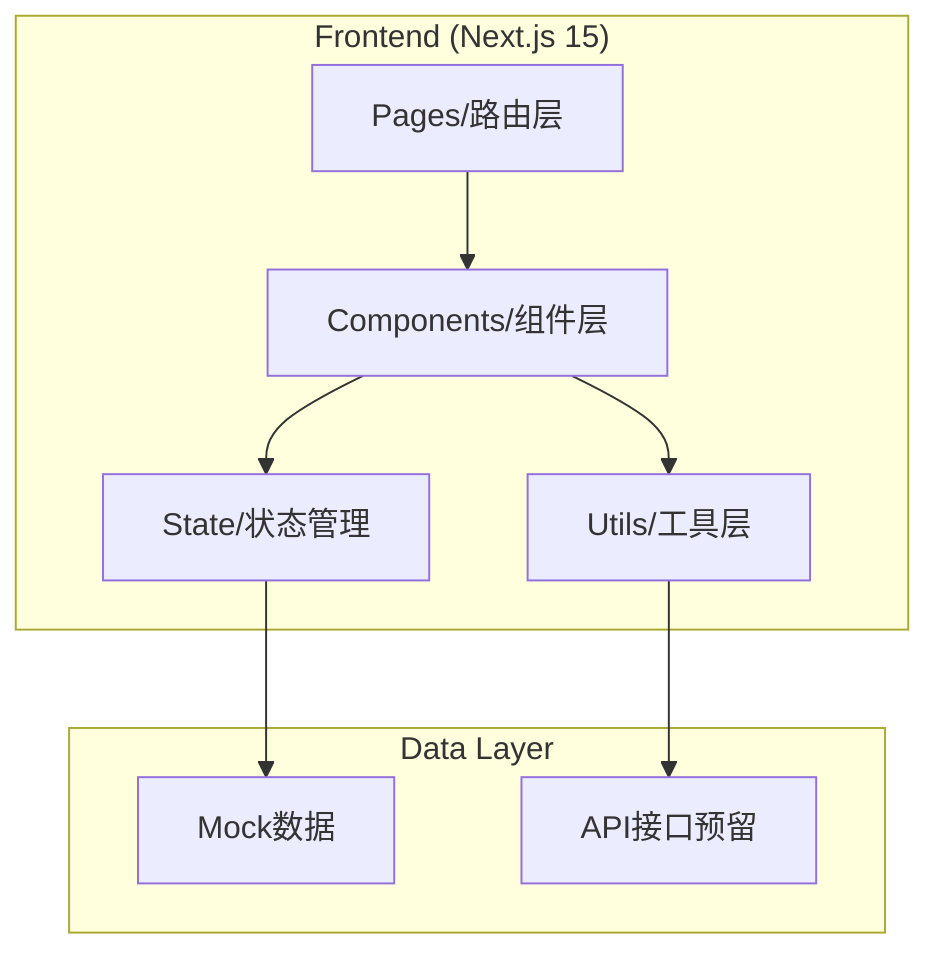

# 外卖配送骑手端应用 - 技术架构文档

## 1. Architecture Design



## 2. Technology Description

- **Frontend**: Next.js 15 + React 18 + TypeScript + Tailwind CSS
- **UI Components**: shadcn/ui
- **Icons**: lucide-react
- **State Management**: React Context API + Hooks
- **Routing**: Next.js App Router
- **Build Tool**: Next.js Built-in
- **Deployment**: Vercel

## 3. Route Definitions

| Route | Purpose |
|-------|---------|
| / | 待接单页面（首页） |
| /order/[id] | 订单详情页 |
| /navigation/[id] | 导航取货页 |
| /pickup/[id] | 确认取货页 |
| /complete/[id] | 任务完成页 |
| /history | 历史订单页 |
| /wallet | 钱包页 |
| /profile | 个人中心页 |

## 4. Data Types

### 4.1 Order Type

```typescript
interface Order {
  id: string;
  orderNumber: string;
  type: '配送' | '特快送';
  status: 'pending' | 'accepted' | 'picking' | 'delivering' | 'completed';
  merchant: {
    name: string;
    address: string;
    phone: string;
    tags: string[];
  };
  user: {
    name: string;
    address: string;
    phone: string;
  };
  distance: number;
  estimatedTime: number;
  payment: number;
  subsidy?: number;
  items: OrderItem[];
  pickupCode?: string;
  createdAt: string;
}

interface OrderItem {
  id: string;
  name: string;
  quantity: number;
  note?: string;
  checked: boolean;
}
```

### 4.2 Wallet Type

```typescript
interface Wallet {
  balance: number;
  todayEarnings: number;
  totalOrders: number;
}
```

## 5. File Structure

```
/workspace
├── app/
│   ├── layout.tsx
│   ├── page.tsx                    # 待接单页
│   ├── globals.css
│   ├── order/
│   │   └── [id]/
│   │       └── page.tsx           # 订单详情页
│   ├── navigation/
│   │   └── [id]/
│   │       └── page.tsx           # 导航取货页
│   ├── pickup/
│   │   └── [id]/
│   │       └── page.tsx           # 确认取货页
│   ├── complete/
│   │   └── [id]/
│   │       └── page.tsx           # 任务完成页
│   ├── history/
│   │   └── page.tsx               # 历史订单页
│   ├── wallet/
│   │   └── page.tsx               # 钱包页
│   └── profile/
│       └── page.tsx               # 个人中心页
├── components/
│   ├── ui/                        # shadcn/ui 组件
│   │   ├── button.tsx
│   │   ├── card.tsx
│   │   ├── badge.tsx
│   │   ├── input.tsx
│   │   └── ...
│   ├── layout/
│   │   ├── Header.tsx
│   │   └── BottomNav.tsx
│   ├── shared/
│   │   ├── OrderCard.tsx
│   │   ├── MapView.tsx
│   │   └── OrderItemList.tsx
│   └── ...
├── lib/
│   ├── mock/
│   │   ├── orders.ts
│   │   └── wallet.ts
│   ├── types/
│   │   └── index.ts
│   └── utils.ts
├── public/
├── package.json
├── tsconfig.json
├── tailwind.config.ts
├── next.config.ts
└── vercel.json
```

## 6. State Management

使用 React Context API 管理全局状态：

```typescript
interface AppContextType {
  orders: Order[];
  currentOrder: Order | null;
  setCurrentOrder: (order: Order | null) => void;
  acceptOrder: (orderId: string) => void;
  completeOrder: (orderId: string) => void;
}
```

## 7. Mock Data Structure

- `lib/mock/orders.ts`: 订单模拟数据
- `lib/mock/wallet.ts`: 钱包模拟数据

## 8. Deployment Configuration

- `vercel.json`: Vercel 部署配置
- `next.config.ts`: Next.js 配置
- 支持 GitHub 自动部署
