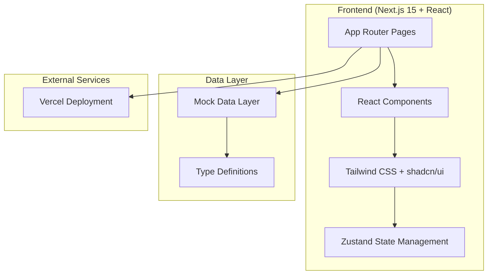

# PulseTrack - 健身训练应用 - 技术架构文档

## 1. Architecture Design



## 2. Technology Description

- **Frontend**: Next.js@15 + React@18 + TypeScript@5 + tailwindcss@3
- **Initialization Tool**: create-next-app
- **State Management**: Zustand
- **Icons**: lucide-react
- **Styling**: Tailwind CSS + shadcn/ui 风格组件
- **Deployment**: Vercel

## 3. Route Definitions

| Route | Purpose |
|-------|---------|
| / | 首页 - 今日训练计划、训练历史 |
| /login | 登录/注册页面 |
| /workout | 训练打卡页面 |
| /stats | 数据统计页面 |
| /profile | 个人中心页面 |

## 4. Data Model

### 4.1 Type Definitions

```typescript
// 用户信息
interface User {
  id: string;
  name: string;
  avatar: string;
  level: number;
  bio: string;
}

// 身体数据
interface BodyStats {
  height: number;
  weight: number;
  bodyFat: number;
  bmi: number;
}

// 训练动作
interface Exercise {
  id: string;
  name: string;
  muscleGroup: string;
  icon: string;
}

// 训练组记录
interface WorkoutSet {
  id: string;
  exerciseId: string;
  weight: number;
  reps: number;
  completed: boolean;
}

// 训练记录
interface WorkoutRecord {
  id: string;
  date: string;
  exercises: Exercise[];
  sets: WorkoutSet[];
  duration: number;
  totalVolume: number;
}

// 统计数据
interface Statistics {
  weeklyVolume: number[];
  muscleGroupDistribution: Record<string, number>;
  prs: Record<string, number>;
}
```

## 5. Project Structure

```
/workspace
├── app/                          # Next.js App Router
│   ├── layout.tsx               # 根布局
│   ├── globals.css              # 全局样式
│   ├── page.tsx                 # 首页
│   ├── login/
│   │   └── page.tsx             # 登录页
│   ├── workout/
│   │   └── page.tsx             # 训练打卡页
│   ├── stats/
│   │   └── page.tsx             # 统计页
│   └── profile/
│       └── page.tsx             # 个人中心页
├── components/
│   ├── ui/                      # shadcn/ui 风格组件
│   │   ├── button.tsx
│   │   ├── card.tsx
│   │   ├── input.tsx
│   │   └── badge.tsx
│   ├── layout/                  # 布局组件
│   │   └── Header.tsx
│   └── shared/                  # 共享组件
│       ├── ExerciseCard.tsx
│       ├── WorkoutHistoryCard.tsx
│       └── Chart.tsx
├── lib/
│   ├── types/                   # 类型定义
│   │   └── index.ts
│   ├── mock/                    # Mock 数据
│   │   └── data.ts
│   ├── store/                   # Zustand 状态管理
│   │   └── useAppStore.ts
│   └── utils.ts                 # 工具函数
├── package.json
├── tsconfig.json
├── tailwind.config.ts
└── next.config.ts
```

## 6. Key Implementation Guidelines

1. **State Management**: Use Zustand for global state
2. **Styling**: Use Tailwind CSS for all styling
3. **Components**: Build reusable UI components
4. **Mock Data**: Implement comprehensive mock data
5. **Animations**: Add subtle animations and transitions
6. **Responsive**: Perfect mobile and desktop support
7. **Accessibility**: Semantic HTML and ARIA attributes
