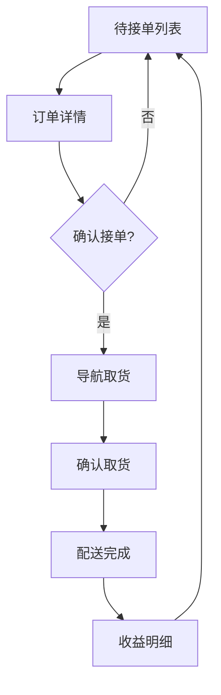

# 外卖配送骑手端应用 - 产品需求文档

## 1. Product Overview

这是一个专业的外卖配送骑手端应用，帮助骑手高效接单、导航取货和配送，管理订单和收益。
- 主要用户：外卖配送骑手
- 核心价值：提升配送效率，优化订单管理，清晰收益统计

## 2. Core Features

### 2.1 User Roles
| Role | Registration Method | Core Permissions |
|------|---------------------|------------------|
| 骑手 | 手机号注册 | 接单、导航、查看订单、管理钱包 |

### 2.2 Feature Module
1. **待接单页**: 订单列表展示、筛选、接单
2. **导航取货页**: 地图导航、剩余距离、预计到达时间
3. **确认取货页**: 商品核对、拍照、扫码、验证码
4. **任务完成页**: 配送成功提示、收益明细
5. **订单详情页**: 订单信息、路线预览、操作按钮
6. **底部导航**: 任务、历史、钱包、我的

### 2.3 Page Details
| Page Name | Module Name | Feature description |
|-----------|-------------|---------------------|
| 待接单页 | 订单列表 | 展示待接订单，包含商户信息、用户地址、距离、预计时间、报酬 |
| 待接单页 | 接单功能 | 点击"立即接单"按钮接取订单 |
| 导航取货页 | 地图导航 | 展示地图和路线，显示剩余距离和预计到达时间 |
| 导航取货页 | 商户信息 | 展示取货商户详情和联系方式 |
| 确认取货页 | 商品核对 | 核对商品清单，支持勾选确认 |
| 确认取货页 | 验证功能 | 拍照、扫码、输入取货码验证 |
| 任务完成页 | 收益展示 | 展示本次配送收入明细 |
| 任务完成页 | 操作按钮 | 返回任务列表、查看订单详情 |
| 订单详情页 | 订单信息 | 展示完整订单信息、商户和用户详情 |
| 订单详情页 | 路线预览 | 地图路线预览功能 |
| 订单详情页 | 接单/拒单 | 支持立即接单或暂不接单 |

## 3. Core Process

骑手接单流程：查看待接单列表 → 选择订单查看详情 → 立即接单 → 导航前往取货 → 到达商家确认取货 → 配送完成 → 查看收益。

## 4. User Interface Design

### 4.1 Design Style
- **主色调**: 蓝色 (#6366f1) 为主，搭配浅色系背景
- **按钮样式**: 圆角矩形，主按钮使用蓝色填充
- **字体**: 现代无衬线字体，清晰易读
- **布局风格**: 卡片式布局，底部导航栏
- **图标**: 线性风格图标，简洁现代

### 4.2 Page Design Overview
| Page Name | Module Name | UI Elements |
|-----------|-------------|-------------|
| 待接单页 | 订单卡片 | 白色卡片、灰色边框、信息分层展示 |
| 导航取货页 | 地图区域 | 浅色背景、地图示意、信息浮层 |
| 确认取货页 | 核对区域 | 商品列表、勾选框、验证按钮 |
| 任务完成页 | 成功提示 | 大图标、绿色成功状态、清晰金额展示 |
| 订单详情页 | 信息区域 | 分层卡片、展开/收起、路线预览 |

### 4.3 Responsiveness
- Mobile-first 设计
- 完美适配各种移动设备尺寸
- 触摸交互优化
- 支持横屏/竖屏切换

### 4.4 设计细节
- 圆角：8-16px 圆角设计
- 阴影：柔和的卡片阴影
- 间距：4px 基础单位，统一间距规范
- 动画：页面切换动画、按钮点击反馈
