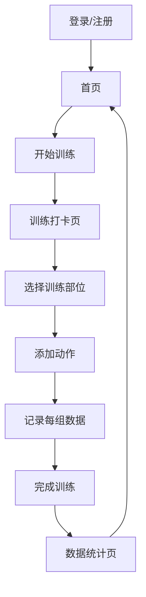

# PulseTrack - 健身训练应用 - 产品需求文档

## 1. Product Overview

这是一个专业的健身训练记录与数据追踪应用，帮助用户记录训练、管理运动数据、查看统计分析，打造完美的训练体验。
- 主要用户：健身爱好者、运动人士
- 核心价值：简化训练记录、提供数据洞察、提升训练效果

## 2. Core Features

### 2.1 User Roles
| Role | Registration Method | Core Permissions |
|------|---------------------|------------------|
| 普通用户 | 邮箱/手机号注册 | 记录训练、查看统计、管理个人信息 |

### 2.2 Feature Module
1. **登录/注册页**: 登录表单、注册选项、社交登录
2. **首页**: 今日训练计划、最近训练历史、快捷操作
3. **训练打卡页**: 训练部位选择、动作列表、组记录、完成训练
4. **数据统计页**: 数据可视化图表、训练趋势分析、个人记录
5. **个人中心页**: 用户信息、身体数据、目标设置、账号管理

### 2.3 Page Details
| Page Name | Module Name | Feature description |
|-----------|-------------|---------------------|
| 登录/注册页 | 登录表单 | 邮箱/手机号输入、密码输入、登录按钮、忘记密码 |
| 登录/注册页 | 注册选项 | 切换登录/注册、社交登录按钮 |
| 首页 | 今日训练计划 | 展示当天训练内容、进度条、快捷按钮 |
| 首页 | 最近训练历史 | 列表展示最近训练记录、查看详情 |
| 训练打卡页 | 训练部位选择 | 胸部、背部、腿部等部位选择 |
| 训练打卡页 | 动作列表 | 可添加动作、编辑动作参数 |
| 训练打卡页 | 组记录 | 记录每组重量、次数、操作按钮 |
| 数据统计页 | 数据图表 | 容量趋势、训练分布热力图、柱状图 |
| 数据统计页 | 时间选择 | 周/月/年数据切换 |
| 个人中心页 | 用户信息 | 头像、昵称、等级、个人描述 |
| 个人中心页 | 身体数据 | 身高、体重、体脂率、BMI |
| 个人中心页 | 目标进度 | 目标体重、目标体脂率进度条 |

## 3. Core Process

用户训练流程：打开应用 → 查看今日计划 → 开始训练打卡 → 选择部位 → 添加动作 → 记录每组数据 → 完成训练 → 查看统计数据。

## 4. User Interface Design

### 4.1 Design Style
- **主色调**: 天蓝色 (#22c55e) 为主，活力蓝 (#3b82f6) 为辅，鲜明活泼，体现运动感
- **按钮样式**: 圆角矩形，主按钮使用蓝色填充，白色文字，清晰醒目
- **字体**: 现代无衬线字体，大号标题、中等正文、小号标注
- **布局风格**: 卡片式布局，顶部导航，底部浮动按钮，清爽简洁
- **图标**: 线性风格图标，简洁现代，运动相关的图标（哑铃、心跳、计时器等）

### 4.2 Page Design Overview
| Page Name | Module Name | UI Elements |
|-----------|-------------|-------------|
| 登录/注册页 | 左右分栏布局 | 左侧品牌展示区（蓝色背景）、右侧登录表单区（白色） |
| 首页 | 今日训练卡片 | 浅蓝渐变背景、圆角卡片、进度条动画 |
| 首页 | 训练历史列表 | 白色卡片、浅灰色边框、信息分层展示 |
| 训练打卡页 | 部位选择网格 | 网格布局、选中状态高亮、图标展示 |
| 训练打卡页 | 动作卡片 | 白色背景、组记录区域、操作按钮 |
| 数据统计页 | 图表区域 | 大尺寸图表、多维度数据展示、时间选择器 |
| 个人中心页 | 用户信息区 | 圆形头像、渐变背景、清晰的信息层级 |

### 4.3 Responsiveness
- Desktop-first 设计，完全响应式布局
- 完美适配 PC 端和移动端所有尺寸
- 触摸交互优化，移动端体验丝滑
- 自适应网格和流式布局

### 4.4 设计细节
- 圆角：12-24px 圆角设计，柔和友好
- 阴影：轻微的卡片阴影，增加层次感
- 间距：8px 基础单位，统一间距规范
- 动画：页面切换动画、按钮点击反馈、数据加载动画
